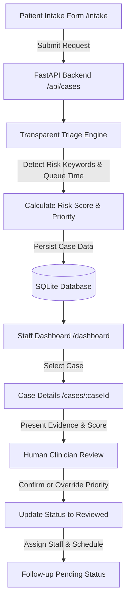

# Post-Discharge Urgency Triage System (35% MVP)

> **Human-reviewed urgency triage prototype for counselling and helpline requests following acute psychiatric care discharge.**

---

## 1. Problem Statement

Patients discharged from acute psychiatric care often require outpatient counselling, follow-up, or helpline assistance. Post-discharge support channels frequently receive a mix of routine administrative queries (e.g., appointment confirmations) and potentially urgent requests expressing acute distress or safety concerns. Without systematic triage support, clinical operations teams face challenges rapidly identifying requests that require priority human review.

---

## 2. Project Objective

The objective of this project is to build a field-ready, 35% working prototype that assists hospital staff by:
1. Automatically evaluating patient-submitted request text against transparent rule-based risk indicators.
2. Generating a preliminary priority recommendation (`LOW`, `MEDIUM`, or `HIGH`) along with clear evidence.
3. Presenting cases on a professional clinical operations dashboard.
4. **Strictly enforcing human-in-the-loop oversight**: Requiring human staff to review evidence, confirm or override preliminary priority ratings, and manage staff assignment and follow-up schedules.

---

## 3. How the System Works



---

## 4. Technology Stack

- **Frontend**:
  - React 18 (JavaScript / JSX)
  - Vite
  - Tailwind CSS v4
  - Lucide React icons
  - React Router v6
  - Recharts
- **Backend**:
  - Python 3.10+
  - FastAPI
  - SQLAlchemy ORM
  - Pydantic v2
  - Uvicorn
- **Database**:
  - SQLite (`hospital_triage.db`)
- **Testing**:
  - Pytest & HTTPX

---

## 5. Repository Folder Structure

```
hospital-triage-mvp/
├── frontend/
│   ├── src/
│   │   ├── components/
│   │   │   ├── Navbar.jsx
│   │   │   ├── PriorityBadge.jsx
│   │   │   ├── StatusBadge.jsx
│   │   │   ├── PriorityChart.jsx
│   │   │   └── DisclaimerBanner.jsx
│   │   ├── pages/
│   │   │   ├── LandingPage.jsx
│   │   │   ├── PatientIntakePage.jsx
│   │   │   ├── DashboardPage.jsx
│   │   │   └── CaseDetailsPage.jsx
│   │   ├── services/
│   │   │   └── api.js
│   │   ├── App.jsx
│   │   ├── main.jsx
│   │   └── index.css
│   ├── package.json
│   └── vite.config.js
│
├── backend/
│   ├── app/
│   │   ├── main.py
│   │   ├── database.py
│   │   ├── models.py
│   │   ├── schemas.py
│   │   ├── routes/
│   │   │   ├── cases.py
│   │   │   └── dashboard.py
│   │   └── services/
│   │       └── triage_engine.py
│   ├── tests/
│   │   ├── test_triage_engine.py
│   │   └── test_api.py
│   ├── seed.py
│   └── requirements.txt
│
├── README.md
├── .gitignore
└── docker-compose.yml
```

---

## 6. Transparent Triage Rules

The Python triage engine (`backend/app/services/triage_engine.py`) uses a transparent keyword scoring system:

| Risk Category | Score Weight | Trigger Phrase Examples |
| :--- | :---: | :--- |
| **Safety Concern** | **+5** | `"unsafe"`, `"not safe"`, `"don't feel safe"`, `"danger"`, `"can't keep myself safe"`, `"harm"`, `"end it"` |
| **Severe Distress** | **+3** | `"extremely distressed"`, `"very distressed"`, `"overwhelmed"`, `"can't cope"`, `"desperate"`, `"breaking down"` |
| **Urgency Language** | **+2** | `"immediately"`, `"right now"`, `"urgent"`, `"asap"` |
| **Support Isolation** | **+2** | `"alone"`, `"no one to help"`, `"nobody"`, `"isolated"` |
| **Queue Operational Boost** | **+1** | `waiting_time_minutes > 30` |

### Prototype Priority Thresholds:
- **0 – 2**: `LOW` Priority (Green)
- **3 – 5**: `MEDIUM` Priority (Amber)
- **6+**: `HIGH` Priority (Red)

> *Note: These rule thresholds are prototype thresholds designed for synthetic demonstration and are NOT medically validated clinical thresholds.*

---

## 7. Human-in-the-Loop Workflow

**Critical Requirement**: Automated system recommendations NEVER automatically finalize clinical decisions or actions.

- **System Recommendation**: Prominently displays: `"Prototype recommendation — human review required"`.
- **Human Controls**:
  - Staff click `Confirm Priority` to accept system priority OR `Override Priority` to select `LOW`, `MEDIUM`, or `HIGH`.
  - Staff must enter their name and a reviewer note explaining the clinical rationale.
  - The database records both `system_priority` and `final_priority` alongside timestamped reviewer metadata.
- **Assignment**: Staff assign cases to `Staff A`, `Staff B`, or `Staff C` with target follow-up due times.

---

## 8. Synthetic Data

All pre-populated records (`P001` through `P018`) generated by `backend/seed.py` are strictly **synthetic demo data**. No real patient health information (PHI) is stored or processed.

---

## 9. API Endpoints

- `POST /api/cases` — Submit new patient support request.
- `GET /api/cases` — List cases with priority/status filters and search.
- `GET /api/cases/{case_id}` — Get case details, risk indicators, review history, and followups.
- `POST /api/cases/{case_id}/review` — Submit human review decision (confirm or override priority).
- `POST /api/cases/{case_id}/assign` — Assign staff member and set follow-up due time.
- `GET /api/dashboard/stats` — Fetch KPI counts and priority distribution chart data.

Automatic interactive OpenAPI documentation is available at `http://localhost:8000/docs`.

---

## 10. Installation & Run Instructions

### Prerequisites
- Python 3.10+
- Node.js 18+ and npm

### Backend Setup
```bash
cd backend

# Create virtual environment (optional)
python -m venv .venv
# On Windows: .venv\Scripts\activate
# On macOS/Linux: source .venv/bin/activate

# Install dependencies
pip install -r requirements.txt

# Seed synthetic database (P001 - P018)
python seed.py

# Start FastAPI Uvicorn dev server
uvicorn app.main:app --reload --port 8000
```
Backend will be live at `http://localhost:8000` with Swagger UI at `http://localhost:8000/docs`.

### Frontend Setup
```bash
cd frontend

# Install dependencies
npm install

# Start Vite dev server
npm run dev
```
Frontend will be live at `http://localhost:5173`.

---

## 11. Testing Instructions

Run the pytest suite to verify triage rules, score thresholds, evidence generation, and API endpoints:

```bash
cd backend
python -m pytest
```

Expected output: `8 passed in 2.00s`.

---

## 12. End-to-End Demonstration Script

Follow this sequence for the college demo:

1. Open `http://localhost:5173/intake`.
2. Select **Helpline** request type and submit message:
   `"I am feeling very distressed and I don't feel safe being alone."`
3. Verify patient receives confirmation: *"Your support request has been submitted."* (Clinical scores are hidden).
4. Open Staff Dashboard (`http://localhost:5173/dashboard`).
5. Observe newly created case with **HIGH** priority badge and **Pending Review** status.
6. Click **View** to inspect case details.
7. Verify detected risk indicators (**Safety Concern** +5, **Severe Distress** +3, **Support Isolation** +2) and risk score **10**.
8. Verify prominent disclaimer: `"Prototype recommendation — human review required"`.
9. Click **Confirm Priority**, enter reviewer note, and submit review. Status updates to **Reviewed**.
10. Select **Staff A**, set follow-up due time (e.g. `Today, 3:30 PM`), and submit assignment. Status updates to **Follow-up Pending**.
11. Return to dashboard and confirm KPI metrics and table reflect the updated status.

---

## 13. Scope & Future Scope

### Implemented in 35% MVP:
- [x] Patient intake form with hidden clinical scores
- [x] Synthetic support request seed dataset (`P001` - `P018`)
- [x] Transparent rule-based triage engine with evidence generation
- [x] LOW / MEDIUM / HIGH priority classification
- [x] Staff operations dashboard with filters, search, and Recharts visualization
- [x] Case details view with risk indicator breakdown
- [x] Human review panel with priority confirmation & override
- [x] Staff assignment & follow-up scheduling
- [x] SQLite database persistence
- [x] Pytest automated test suite
- [x] Clean healthcare UI/UX design system

### Intentionally Not Implemented (Future Scope):
- Machine learning / LLM automated diagnosis models
- Integration with real hospital EHR systems
- Live emergency service dispatch (911 / 988)
- Real patient authentication & SSO
- SMS / Email notifications
- Complex microservice architectures

---

## 14. Ethical & Safety Limitations

> [!CAUTION]
> This repository contains a student prototype using synthetic data and transparent rule-based logic. It is **NOT** a medical diagnostic tool, suicide risk prediction model, or emergency response system. It must **NEVER** be deployed for live clinical decision-making without formal clinical validation and institutional approval.
